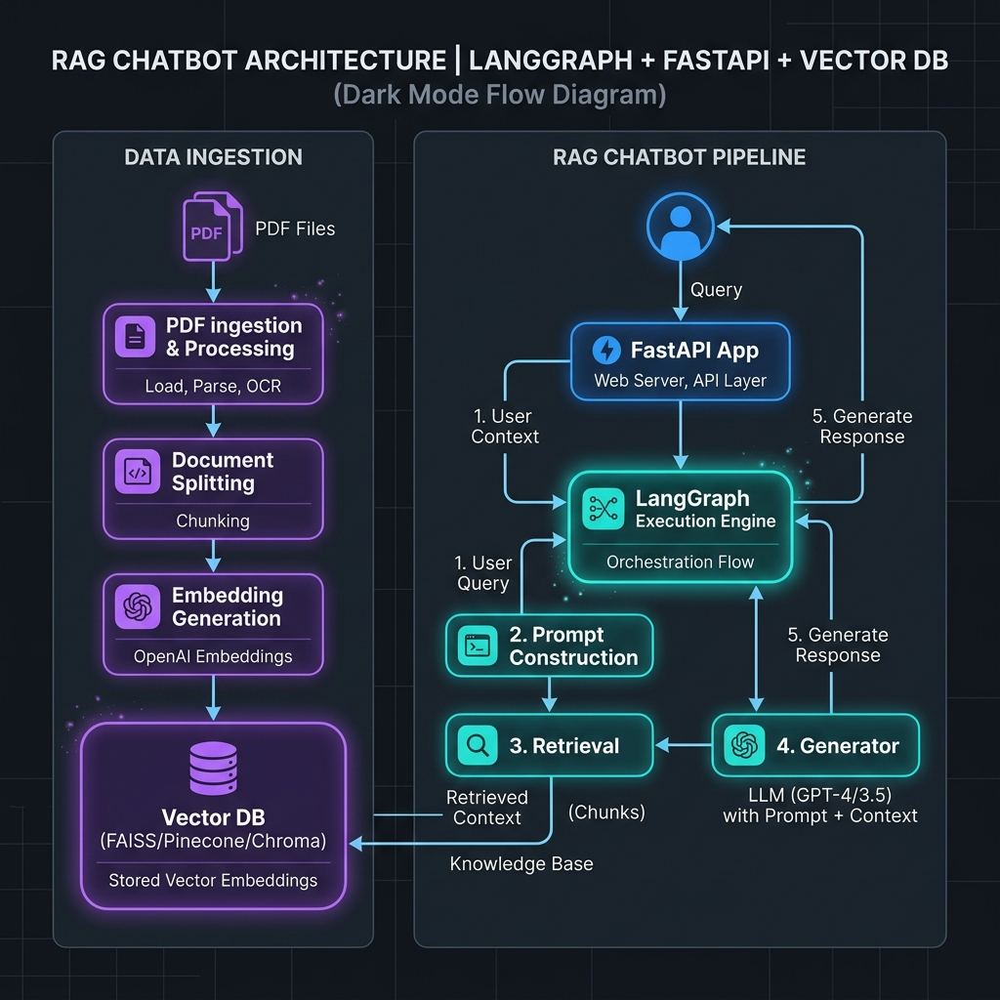

# AgenticAI-RAG-Chatbot 🤖📚

[](https://www.python.org/downloads/)
[](https://github.com/langchain-ai/langgraph)
[](https://fastapi.tiangolo.com/)
[](LICENSE)

A production-ready, interview-grade Retrieval-Augmented Generation (RAG) chatbot developed using **LangGraph**, **FastAPI**, **LangChain**, and **Chroma DB / Pinecone**.

The chatbot answers user questions **ONLY** from the provided `"Agentic AI eBook"` PDF (`data/Ebook-Agentic-AI.pdf`). If the requested information is not present within the eBook context, the chatbot strictly responds with:

> `"I couldn't find this information in the provided Agentic AI eBook."`

---

## 🏛️ System Architecture

```text
       ┌────────────────────────┐
       │   Ebook-Agentic-AI.pdf │
       └───────────┬────────────┘
                   │
                   ▼
       ┌────────────────────────┐
       │   PyPDF & Text Splitter│ (Chunk: 1000, Overlap: 200)
       └───────────┬────────────┘
                   │
                   ▼
       ┌────────────────────────┐
       │  Vector Embeddings     │ (OpenAI / Gemini Embeddings)
       └───────────┬────────────┘
                   │
                   ▼
       ┌────────────────────────┐
       │ Chroma DB / Pinecone   │ (Vector Store)
       └───────────┬────────────┘
                   │
                   ▼
       ┌────────────────────────┐
       │   LangGraph Workflow   │ ◄─── User Question (POST /chat)
       │  • Retriever Node      │
       │  • ContextBuilder Node │
       │  • LLM Node (Strict)   │
       │  • Formatter Node      │
       └───────────┬────────────┘
                   │
                   ▼
       ┌────────────────────────┐
       │    FastAPI JSON Output │ (answer, context, confidence)
       └────────────────────────┘
```



---

## ⚡ Key Features & Engineering Highlights

- **LangGraph Orchestration**: Stateful graph workflow (`Retriever` ➔ `ContextBuilder` ➔ `LLM` ➔ `ResponseFormatter`) with conditional routing.
- **Strict Anti-Hallucination Guardrail**: System prompt and score thresholding strictly prevent prior knowledge leaks or guessing.
- **Normalized Confidence Score**: Cosine vector similarity normalized strictly between `0.0` and `1.0`.
- **Vector Store Versatility**: Zero-config persistent local **Chroma DB** with support for **Pinecone** cloud index via `.env`.
- **Provider Choice**: Configurable support for **OpenAI** (`gpt-4o-mini`, `text-embedding-3-small`) and **Google Gemini** (`gemini-1.5-flash`, `text-embedding-004`).
- **Startup Validation**: `app/api.py` checks vector database population and environment keys during server startup.
- **Rich Diagnostic Endpoint**: `GET /health` returns live health, active vector store, LLM provider, and total document vector count.

---

## 🔬 Retrieval Strategy & Parameters

| Parameter | Value / Model | Description |
| :--- | :--- | :--- |
| **Chunk Size** | `1000` | Maximum character length per text chunk |
| **Chunk Overlap** | `200` | Contextual overlap between consecutive chunks |
| **Retrieval Top-K** | `4` | Number of vector chunks retrieved per query |
| **Embedding Models** | `text-embedding-3-small` / `text-embedding-004` | High-dimensional semantic text vectors |
| **Confidence Threshold**| `0.35` | Minimum normalized score required for LLM synthesis |

> *Note: The returned confidence score reflects vector retrieval similarity and is an approximate relevance metric, not an LLM probability score.*

---

## 🚀 Quickstart & Setup

### 1. Prerequisites
- Python **3.11** or higher
- Git

### 2. Installation

Clone the repository and install dependencies:

```bash
git clone https://github.com/piyushxbhardwaj/AgenticAI-RAG-Chatbot.git
cd AgenticAI-RAG-Chatbot

# Create and activate virtual environment
python -m venv .venv
# On Windows:
.venv\Scripts\activate
# On Linux/macOS:
source .venv/bin/activate

# Install requirements
pip install -r requirements.txt
# Or using Makefile:
make install
```

### 3. Environment Configuration

Copy the example environment file and configure your API keys:

```bash
cp .env.example .env
```

Edit `.env`:

```ini
LLM_PROVIDER=openai
OPENAI_API_KEY=your_openai_api_key_here
VECTOR_STORE_TYPE=chroma
```

### 4. Document Ingestion

Ensure `data/Ebook-Agentic-AI.pdf` is present, then execute the ingestion script:

```bash
python app/ingest.py
# Or using Makefile:
make ingest
```

### 5. Launch API Server

Run the FastAPI development server with auto-reload:

```bash
uvicorn app.api:app --reload
# Or using Makefile:
make run
```

Access interactive API documentation at: `http://localhost:8000/docs`

---

## 📡 API Reference

### `POST /chat`

Submit a question to the RAG chatbot.

#### Request Example
```json
POST /chat
Content-Type: application/json

{
  "question": "What is ReAct?"
}
```

#### Response Example
```json
{
  "answer": "ReAct (Reasoning and Acting) is an architectural framework where an AI agent alternates between explicit reasoning traces and action execution steps.",
  "context": [
    "Chapter 2: The ReAct Framework (Reasoning and Acting)\nReAct (Reasoning + Acting) is a fundamental architectural paradigm..."
  ],
  "confidence": 0.91
}
```

---

### `GET /health`

Retrieve API server status and vector index diagnostic statistics.

#### Response Example
```json
{
  "status": "healthy",
  "vector_store": "chroma",
  "llm_provider": "openai",
  "documents_indexed": 12
}
```

---

## 📊 Evaluation Matrix

The chatbot was evaluated against a suite of in-domain and out-of-domain questions to verify grounding and anti-hallucination guardrails:

| Query | Category | Expected Response Behavior |
| :--- | :--- | :--- |
| **What is ReAct?** | In-Domain | Returns detailed answer from eBook + Context + High Confidence |
| **Explain agent memory.** | In-Domain | Explains Short-term, Working, and Long-term memory from eBook |
| **How does LangGraph work?** | In-Domain | Explains stateful graph orchestration from eBook |
| **What are planning agents?**| In-Domain | Explains task decomposition and planning strategies |
| **What is tool calling?** | In-Domain | Explains LLM tool execution interface |
| **What is the capital of France?** | Out-of-Domain | `"I couldn't find this information in the provided Agentic AI eBook."` |
| **Who won IPL 2025?** | Out-of-Domain | `"I couldn't find this information in the provided Agentic AI eBook."` |
| **What is quantum computing?**| Out-of-Domain | `"I couldn't find this information in the provided Agentic AI eBook."` |

---

## 🧪 Testing

Run unit and integration tests using `pytest`:

```bash
pytest tests/ -v
# Or using Makefile:
make test
```

---

## 📜 Commit Workflow History

This repository demonstrates clean development discipline using 5 logical git commits:

1. `chore: initialize project structure` - Scaffold, dependencies, licenses, Makefile, CI workflow.
2. `feat: implement document ingestion pipeline` - PDF loader, chunker, vector store manager (`ingest.py`, `retrieval.py`).
3. `feat: build LangGraph retrieval workflow` - Stateful graph, nodes, routing, anti-hallucination logic (`graph.py`, `rag.py`, `llm.py`).
4. `feat: expose RAG chatbot API` - FastAPI server, request/response models, `/health`, `/chat` (`api.py`, `models.py`).
5. `docs: finalize interview submission` - Comprehensive README, architecture, evaluation matrix, test suite.

---

## ⚖️ License

Distributed under the [MIT License](LICENSE).
